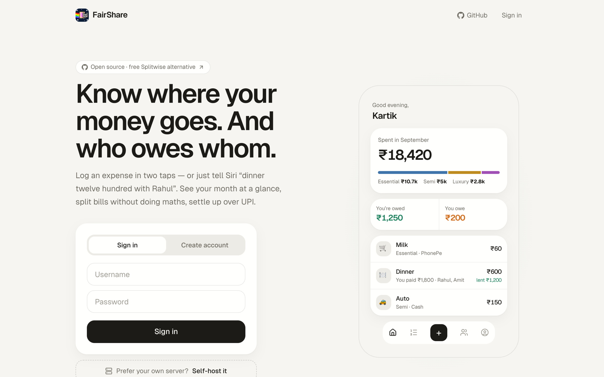
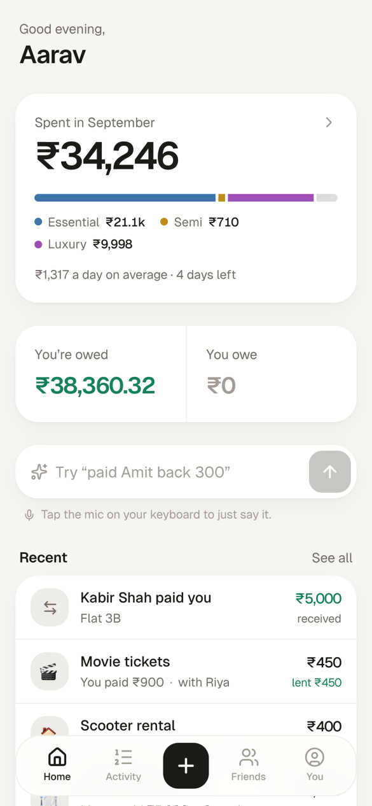
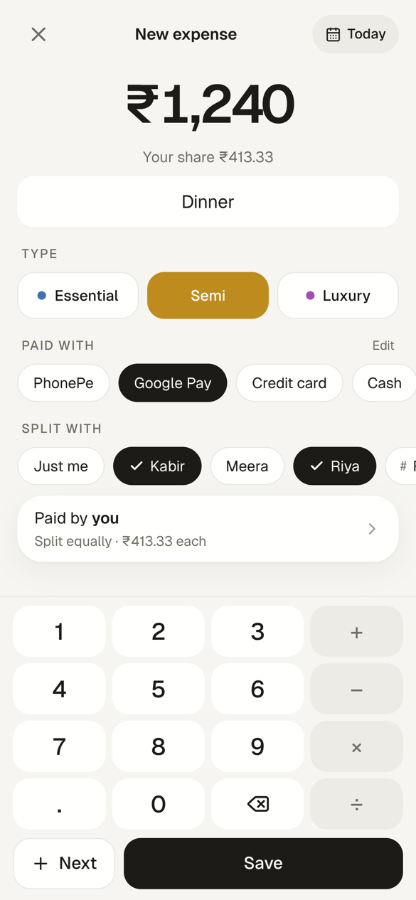
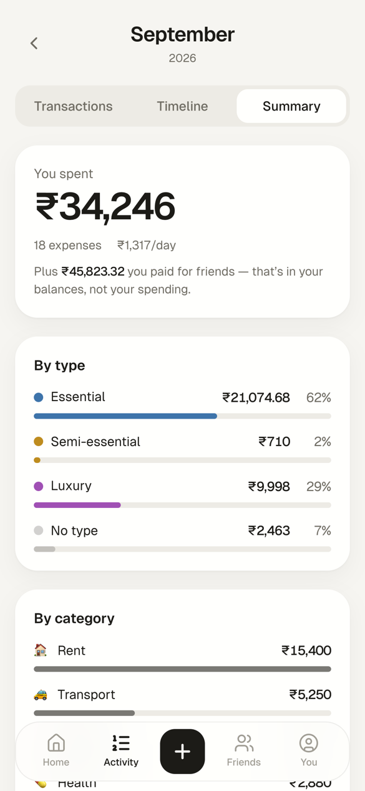
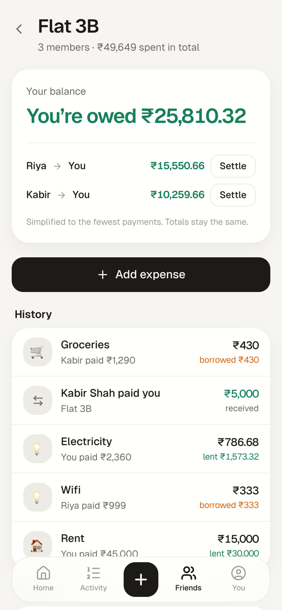
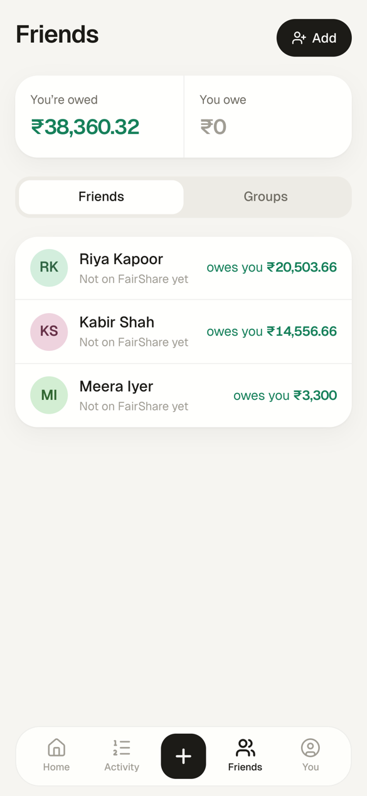
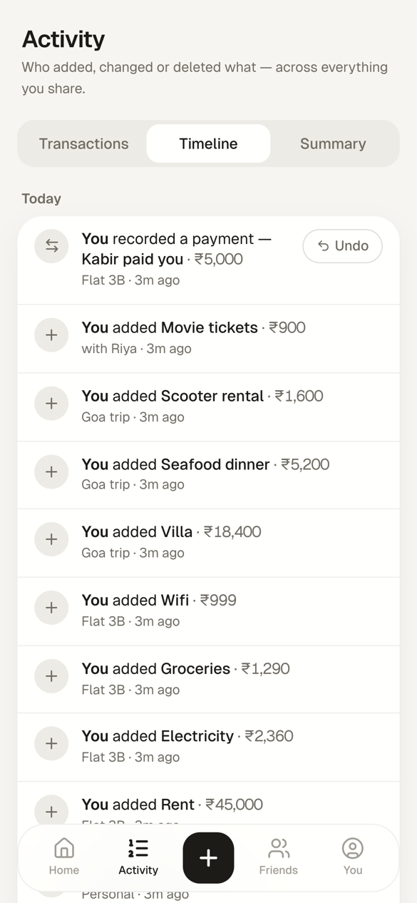

<div align="center">


# FairShare

### The open-source, self-hostable Splitwise alternative — with personal expense tracking built in

Split bills with friends and groups, track your own spending, add expenses by voice with Siri, and settle up over UPI.
Free forever. No ads. No daily limits. Your data on your server.

[**Live app**](https://split.kartikgautam.com) · [**Self-host in one command**](#self-hosting) · [Features](#features) · [Siri & AI](#add-expenses-by-voice-siri--ai) · [MCP server](#mcp-server-use-fairshare-from-claude)



</div>

---

## Why FairShare?

Splitwise now limits free users to a handful of expenses a day, shows ads, and paywalls basics like search and charts. And it only tracks *shared* money — your own spending lives in a different app.

FairShare does both jobs in one place:

- **Splitting with friends** — who owes whom, per friend and per group, with the fewest payments to settle up.
- **Your own spending** — every expense tagged **Essential / Semi-essential / Luxury** and by payment method (PhonePe, Google Pay, credit card, cash…), with a clear monthly summary.

Because it's one ledger, a ₹1,800 dinner split three ways counts **₹600 toward your spending** and **₹1,200 as money you're owed** — automatically.

It's a fast, installable **PWA** (iPhone, Android, desktop), it's **MIT-licensed**, and you can **self-host it with Docker in one command**.

## Screenshots

<table>
  <tr>
    <td></td>
    <td></td>
    <td></td>
  </tr>
  <tr>
    <td align="center"><b>Home</b> — this month and your balances</td>
    <td align="center"><b>Add</b> — two taps and an amount</td>
    <td align="center"><b>Summary</b> — where the month went</td>
  </tr>
  <tr>
    <td></td>
    <td></td>
    <td></td>
  </tr>
  <tr>
    <td align="center"><b>Groups</b> — simplified debts</td>
    <td align="center"><b>Friends</b> — one number each</td>
    <td align="center"><b>Timeline</b> — every change, restorable</td>
  </tr>
</table>

## Features

**Splitting (everything you use Splitwise for)**
- Friends, groups, and one-off shared expenses with any set of friends
- Split equally, by exact amounts, or "they owe the full amount"; choose who paid
- Group debts simplified to the fewest payments
- Settle up with a one-tap **UPI deep link**, partial payments, and reminders via the share sheet
- Split with people who aren't on FairShare yet — they claim their history later with a link
- Invite links for groups

**Personal spending**
- Custom calculator keypad (`120+45` works), recent-item suggestions, "save & add another"
- Need level (**Essential / Semi / Luxury**), payment methods you define, auto-categories
- It remembers: "milk" gets the type and payment method you used last time
- Monthly summary by need level, category and payment method, vs last month

**Capture without friction**
- **Siri / iOS Shortcuts** — "Hey Siri, spent" → "dinner 1800 with Rahul and Amit on card"
- **Natural language** everywhere — Gemini (free tier) / Groq / OpenAI, with a built-in rule parser as fallback
- **Bank SMS auto-capture** — UPI debit texts land in a *To sort* inbox; payees are remembered
- **Telegram bot** (optional)
- **MCP server** — use FairShare from Claude or any MCP client

**Trust**
- Nothing is ever hard-deleted: deleted expenses and payments stay in history and can be restored
- **Timeline** of every add, edit (with before → after), delete and restore across everything you share
- Push notifications when friends add, change or delete something that involves you
- Named, revocable personal API keys (only a hash is stored)

**App**
- Installable PWA with push notifications, pull-to-refresh, light & dark mode
- Mobile-first, fast on slow networks (instant skeletons, client cache)

## Self-hosting

You need Docker. That's it.

```bash
git clone https://github.com/atomsmasher81/fairshare.git
cd fairshare
docker compose up -d
```

Open **http://localhost:3000** — the first account you create becomes the admin.

On first start the container generates a session secret and push-notification keys and stores them, together with the SQLite database, in the `fairshare-data` volume. **Back that volume up.**

**Try it with demo data:**

```bash
docker compose exec fairshare node scripts/seed-demo.js   # then sign in as demo / demo1234
```

### Configuration

Set these in a `.env` file next to `docker-compose.yml` (all optional):

| Variable | What it does |
|---|---|
| `APP_URL` | Public URL, e.g. `https://money.example.com`. Used in links, and `https://` turns on secure cookies. |
| `GEMINI_API_KEY` | Natural-language entry & Siri sentences. [Free key](https://aistudio.google.com/apikey). Model: `gemini-3.1-flash-lite` (override with `GEMINI_MODEL`). |
| `GROQ_API_KEY` / `OPENAI_API_KEY` | Alternative / fallback AI providers (tried in order Gemini → Groq → OpenAI). |
| `TELEGRAM_BOT_TOKEN`, `TELEGRAM_BOT_USERNAME` | Telegram bot. Start it with `docker compose --profile telegram up -d`. |
| `VAPID_SUBJECT` | Contact for push notifications, e.g. `mailto:you@example.com`. |

Without an AI key, simple entries ("milk 20") and the common sentence shapes ("dinner 1800 with Rahul", "Rahul owes me 500", "paid Amit back 300") still work through the rule parser.

**HTTPS:** put it behind any reverse proxy (Caddy, nginx, Cloudflare Tunnel) and set `APP_URL` to the `https://` address. Push notifications and installing on iPhone need HTTPS.

**Updating:** `git pull && docker compose up -d --build` — database migrations run automatically on start.

### Without Docker

Node 20+:

```bash
cp .env.example .env          # set SESSION_SECRET (32+ random chars)
npm install
npx prisma migrate deploy
npm run build && npm start    # or: npm run dev
```

## Add expenses by voice (Siri + AI)

1. In FairShare: **You → Add by voice with Siri → Create key**.
2. In Shortcuts, make a shortcut named **Spent** with: **Dictate Text** → **Get Contents of URL** (`POST /api/capture`, header `Authorization: Bearer <key>`, JSON body `text` = Dictated Text) → **Get Dictionary Value** `message` → **Show Notification**.
3. Say *"Hey Siri, spent"* — or put it on the Action Button / Back Tap.

```http
POST /api/capture
Authorization: Bearer fs_…
{ "text": "dinner 1800 with Rahul and Amit on card" }   → { "ok": true, "message": "✅ Dinner — ₹1,800 · with Rahul, Amit · your share ₹600" }
{ "sms": "<bank debit SMS>" }                          → lands in "To sort"
```

The in-app page walks through every step, including the SMS automation.

## MCP server (use FairShare from Claude)

FairShare is a remote [MCP](https://modelcontextprotocol.io) server at `/api/mcp` (Streamable HTTP), authenticated with a personal key:

```bash
claude mcp add --transport http fairshare https://your-domain/api/mcp --header "Authorization: Bearer fs_…"
```

Tools: `get_context`, `log_expense`, `add_expense`, `list_transactions`, `month_summary`, `balances`, `friend_history`, `groups`, `record_payment`, `delete_expense`. Every call runs as the key's owner, with the same validation and notifications as the app.

## Tech stack

Next.js 14 (App Router) · TypeScript · Prisma + SQLite · Tailwind CSS · Web Push · MCP TypeScript SDK · Docker. No external services required.

More detail on the product and design decisions: [docs/PRODUCT.md](docs/PRODUCT.md).

## Contributing

Issues and pull requests are welcome. For bigger changes, open an issue first so we can agree on the approach. Run `npm run lint` and `npx tsc --noEmit` before sending a PR.

If FairShare is useful to you, **a ⭐ on GitHub helps other people find it.**

## License

[MIT](LICENSE) © [Kartik Gautam](https://kartikgautam.com)

<sub>FairShare is an independent project and is not affiliated with Splitwise.</sub>
